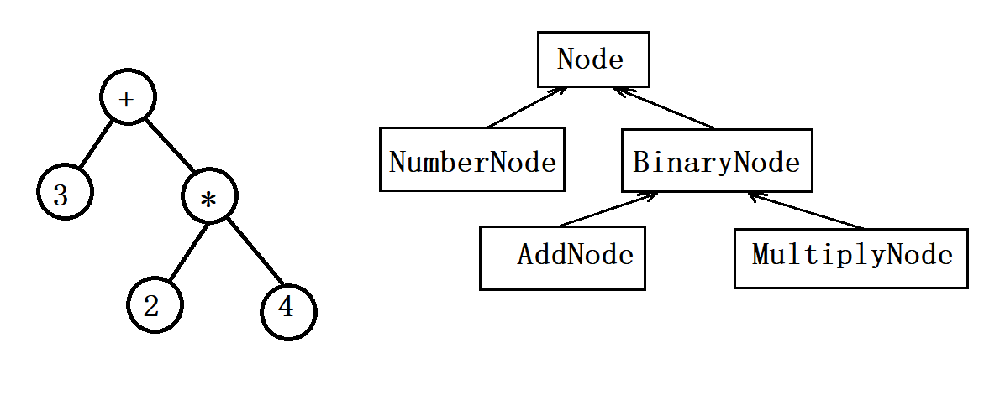

# 一、学习C++

1. 写一个复数类或者大整数类，实现基本的加减乘运算，熟悉封装与数据抽象；

2. 写一个字符串类，熟悉内存管理与拷贝控制；

3. 写一个简化的 vector<T> 类模板，熟悉基本的模板编程
    你的这个 vector 应该能放入 int 和 std::string 等元素类型

4. 写一个表达式计算器，实现一个节点类的继承，体会面向对象编程

    

    表达式计算器能把四则运算式`3+2*4`解析成上图左的表达式树，对根节点调用`calculate()`虚函数就能计算出表达式的值。
    做完之后还可以在扩充功能，比如支持**三角函数**和**变量**。
    在写完面向对象版的表达式树之后，还可以略微尝试泛型编程。比如把类的继承体系化为下图：

    

    然后用`BinaryNode<std::plus<double>>`和`BinaryNode<std::multiplies<double>>`来具现化`BinaryNode<T>`类模板，通过控制模板参数的类型来实现不同的运算。
    在表达式树这个例子中，节点对象是**动态创建**的，值得思考：如何才能安全地、不重不漏地释放内存。

5. 大佬推荐的C++开源代码：

    `Google`的`Protobuf`、`leveldb`、`PCRE`的`C++`封装、陈硕大佬的`muduo`网络库
    这些代码都不长，功能明确，阅读难度不大。
    如果有时间还可以读一读`Chromium`中的基础库代码。
    另外还可以考虑读一些优秀的`C`或`Java`开源项目，并思考是否可以用`C++`更好的实现之（特别是**资源管理方面**能否避免手动清理）

